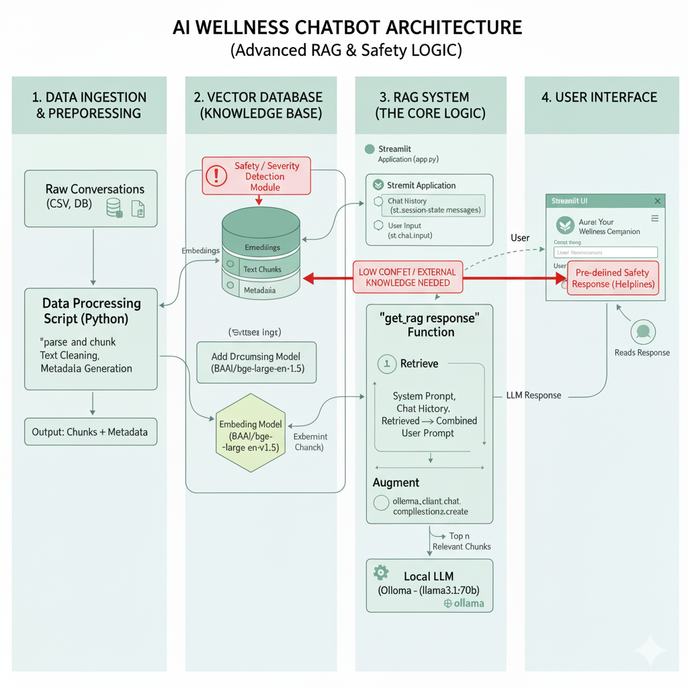

# Aura: AI Wellness Chatbot

Aura is a compassionate and supportive AI wellness assistant designed to provide a safe space for users to discuss their feelings, particularly around stress and mental well-being. Built with a focus on privacy and responsibility, Aura leverages a local Large Language Model (LLM) and a Retrieval-Augmented Generation (RAG) architecture to provide empathetic and contextually relevant responses.

The application is built with Streamlit for a simple and accessible user interface.

## Project Architecture

The architecture is designed to be modular and robust, ensuring that the chatbot's responses are grounded in successful conversational patterns while maintaining user privacy. The system is broken down into four key stages.

-----

### 1\. Data Ingestion & Preprocessing

The foundation of the chatbot's knowledge comes from a dataset of sample conversations.

  * **Raw Conversations:** The process begins with raw, semi-structured conversational data (e.g., from a CSV file).
  * **Preprocessing Script:** A Python script (`build_database.py`) is used to parse this raw data. It cleans the text, structures it, and breaks down long conversations into meaningful **"Human/AI" conversational chunks**.
  * **Metadata Generation:** During this process, crucial metadata such as `conversation_id` and `turn_number` is created and associated with each chunk. This allows for potential filtering and traceability.

-----

### 2\. Vector Database (Knowledge Base)

Once the data is processed, it's transformed into a queryable knowledge base.

  * **Embedding Model:** The powerful `BAAI/bge-large-en-v1.5` model converts the text chunks into numerical vector embeddings. This model is chosen for its high performance in semantic retrieval tasks.
  * **ChromaDB:** A local, persistent vector database is used to store the embeddings, the original text chunks, and their associated metadata. This database acts as the chatbot's long-term memory, holding the examples of empathetic responses.

-----

### 3\. RAG System (The Core Logic)

This is the brain of the application, orchestrating the response generation in a three-step process.

1.  **Retrieve:** When a user sends a message, the system embeds the query using the same embedding model and searches the ChromaDB for the most semantically similar conversational chunks.
2.  **Augment:** The retrieved chunks (examples of good responses) are combined with the chatbot's system prompt (its persona), the current conversation history, and the user's latest message. This creates a rich, context-aware prompt for the LLM.
3.  **Generate:** The augmented prompt is sent to a locally hosted Large Language Model (e.g., `llama3.1:70b`) running via **Ollama**. The LLM generates a new, empathetic response based on the provided context and examples, without ever mentioning the examples directly.

-----

### 4\. User Interface

The user interacts with Aura through a simple and intuitive web interface.

  * **Streamlit:** The entire front-end is built using Streamlit, allowing for rapid development and easy deployment.
  * **Chat Interface:** The UI maintains and displays the conversational history, providing a standard chatbot experience.

## Advanced Features & Safety

To make Aura more robust and responsible, the architecture includes plans for advanced capabilities.

  * **Agentic Fallback (Web Search):** If the vector database returns low-confidence results, the system can pivot to an external tool like a web search API to find relevant articles or information, ensuring the user still receives a helpful response.
  * **Critical Safety Protocol:** The system includes a severity detection layer. If a user's message contains high-risk keywords (e.g., related to self-harm), the standard RAG flow is bypassed. The chatbot immediately provides a pre-defined, safe response containing helpline numbers and other professional resources.


Working Diagram




## Tech Stack

  * **Application Framework:** Streamlit
  * **Vector Database:** ChromaDB
  * **Embedding Model:** Sentence-Transformers (`BAAI/bge-large-en-v1.5`)
  * **LLM Hosting:** Ollama
  * **Core Libraries:** Pandas, PyTorch

## Setup and Installation

Follow these steps to run the project locally.

### Prerequisites

  * Python 3.9+
  * [Ollama](https://ollama.com/) installed and running on your machine.

### Steps

1.  **Clone the Repository:**

    ```bash
    git clone https://github.com/your-username/aura-wellness-chatbot.git
    cd aura-wellness-chatbot
    ```

2.  **Set Up a Virtual Environment:**

    ```bash
    python -m venv venv
    source venv/bin/activate  # On Windows, use `venv\Scripts\activate`
    ```

3.  **Install Dependencies:**

    ```bash
    pip install -r requirements.txt
    ```

4.  **Download LLM and Embedding Models:**

      * The embedding model will be downloaded automatically on the first run.
      * Pull the LLM using Ollama in your terminal:
        ```bash
        ollama pull llama3.1:70b
        ```

5.  **Process Data and Build the Vector Database:**

      * Place your raw conversational data file (e.g., `data.csv`) in the root directory.
      * Run the preprocessing script:
        ```bash
        python build_database.py
        ```
      * This will create a `chroma_db` folder in your project directory containing the vector database.

## How to Run the Application

Once the database is built, launch the Streamlit app:

```bash
streamlit run rag2.py
```

Open your web browser to the local URL provided by Streamlit to start chatting with Aura.

## Ethical Considerations

This project is intended as a proof-of-concept for an AI wellness tool and is **not a substitute for professional medical advice, diagnosis, or treatment**. An initial disclaimer is shown to the user to this effect. The inclusion of the Critical Safety Protocol is a necessary step towards building a responsible AI in the mental health space.
